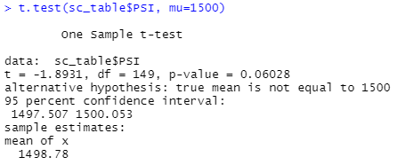
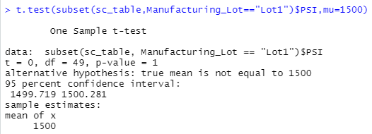
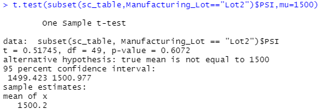
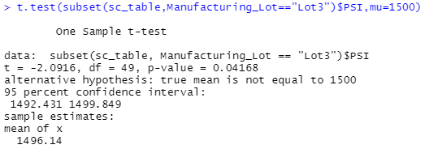

# MechaCar statistical analysis

This analysis uses statistical testing to explore vehicle data from MechaCar, a fictional car manufacturer.

## Linear regression to predict MPG
Two variables appear to have a significant impact on fuel effiency as measured in miles per gallon, or mpg. These variables are vehicle length and ground clearance. 
The other three variables we tested against mpg each had p values of more than 0.07.

Since there is a significant linear relationship between mpg and two of the other variables, the linear model does not have a slope of zero.

Despite a relatively strong R-squared value of about 0.71, this model may not do a great job of predicting mpg for MechaCar prototypes in general, as it may be a case of 
overfitting. Only two of the five dependent variables we tested appear to have a significant impact on mpg. 

The statistically significant intercept also suggests that the model may need additional work to improve its predictive power.

## Summary statistics on suspension coils
Our suspension coil data across all three manufacturing lots shows a mean PSI of 1498.78, a median of 1500, variance of approximately 62.29 and standard deviation of
approximately 7.89.

For lot 1, the variance is less than 0.98, and the standard deviation is less than 0.99. For lot 2, the variance is about 7.47, and the standard deviation is roughly 
2.73. The variance and standard deviation for lot 3 are much greater, at 170.29 and 13.05, respectively. 

According to design specifications for the MechaCar suspension coils, the variance of the suspension coils should not exceed 100 PSI. As such, while the overall 
manufacturing data meet design specifications, lot 3 is far from the mark.

## T-tests on suspension coils
The population mean PSI is 1500. There is not a statistically significant difference between this mean and the mean of our PSIs across all manufacturing lots.

The same is true for the PSI means from manufacturing lots 1 and 2.

However, with a p-value of less than 0.05 from our t test for manufacturing lot 3, we find that this lot's PSI mean is significantly different from the population 
mean.

## Study design: MechaCar versus competition
Using ANOVA testing, we could investigate whether the mean maintenance cost of MechaCar vehicles is significantly different than that of vehicles from other carmakers. 
Our independent variable would be carmaker (categorical data type), and the dependent variable would be maintenance cost (continuous data type). 

The null hypothesis would be that there is no significant correlation between carmaker and maintenance cost. 

In order to run this test, we would need samples of maintenance cost data for comparable vehicles from both MechaCar and at least one other carmaker (preferably more).

We could run similar tests with certain other dependent variables, such as fuel efficiency (miles per gallon).
