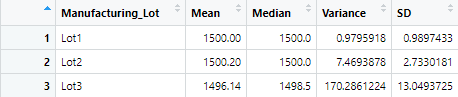

# MechaCar statistical analysis

This analysis...

## Linear regression to predict MPG
Two variables appear to have a significant impact on fuel effiency as measured in miles per gallon, or mpg. These variables are vehicle length and ground clearance. 
The other three variables we tested against mpg each ad p values of more than 0.07.

Since there is a significant linear relationship between mpg and two of the other variables, the linear model does not have a slope of zero.

Despite a relatively strong R-squared value of about 0.71, this model may not do a great job of predicting mpg for MechaCar prototypes in general, as it may be a case of 
overfitting. Only two of the five dependent variables we tested appear to have a significant impact on mpg. 

The statistically significant intercept also suggests that the model may need additional work to improve its predictive power.

## Summary statistics on suspension coils
Our suspension coil data across all three manufacturing lots shows a mean PSI of 1498.78, a median of 1500, variance of approximately 62.29 and standard deviation of
approximately 7.89.

For lot 1, the variance is less than 0.98, and the standard deviation is less than 0.99. For lot 2, the variance is about 7.47, and the standard deviation is roughly 
2.73. The variance and standard deviation for lot 3 are much greater, at 170.29 and 13.05, respectively. 

According to design specifications for the MechaCar suspension coils, the variance of the suspension coils should not exceed 100 PSI. As such, while the overall 
manufacturing data meet design specifications, lot 3 is far from the mark.
